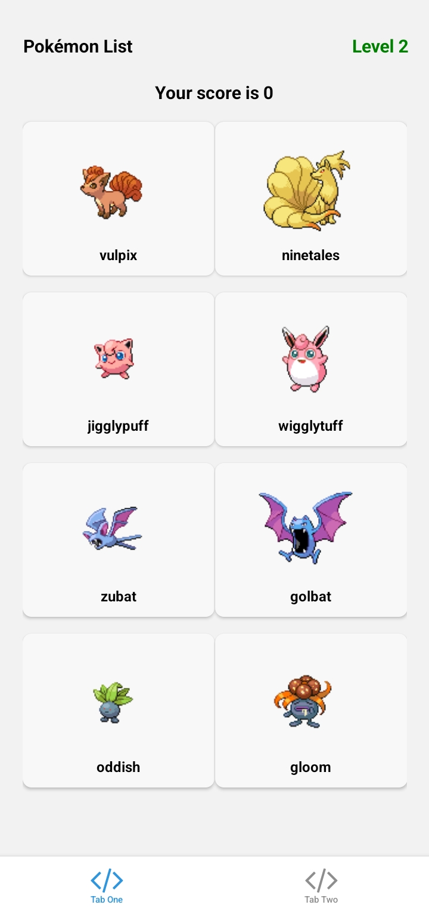

# Pokémon Memory Game

## Welcome to the Pokémon Memory Game!  
This is an exciting and challenging memory game that tests your ability to remember and select Pokémon images without repetition.

### How to Play:
1. **Start with 6 Pokémon images** displayed on your screen.  
2. **Select each Pokémon only once**:
   - If you select a Pokémon **twice**, you lose the game.
   - If you select **all the Pokémon without repeating**, you win and advance to the next level.  
3. The number of Pokémon increases as you progress through the levels, making the game more challenging.

### Features:
- Dynamic Pokémon images fetched from the Pokémon API.
- Interactive sound effects for winning, losing, and card flips.
- Levels with increasing difficulty.
- Clean and responsive UI designed for a fun experience.

### Screenshot:
Here’s how the game looks:  

---

### Good Luck, and may you catch 'em all! 🎮
